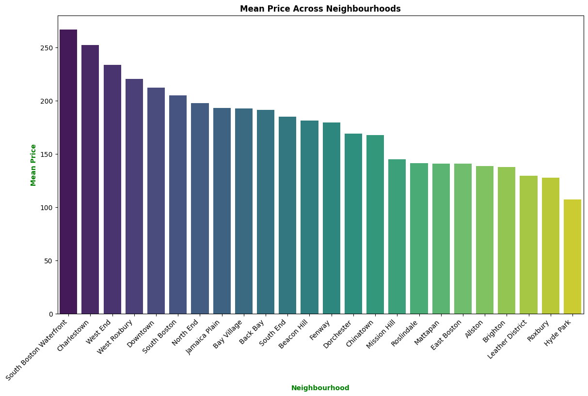
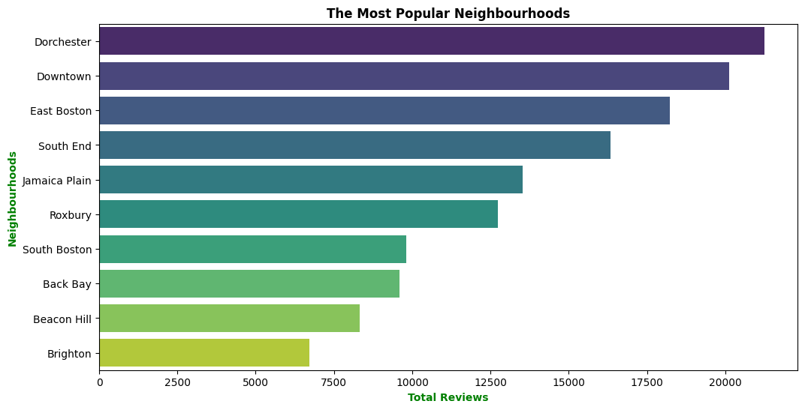
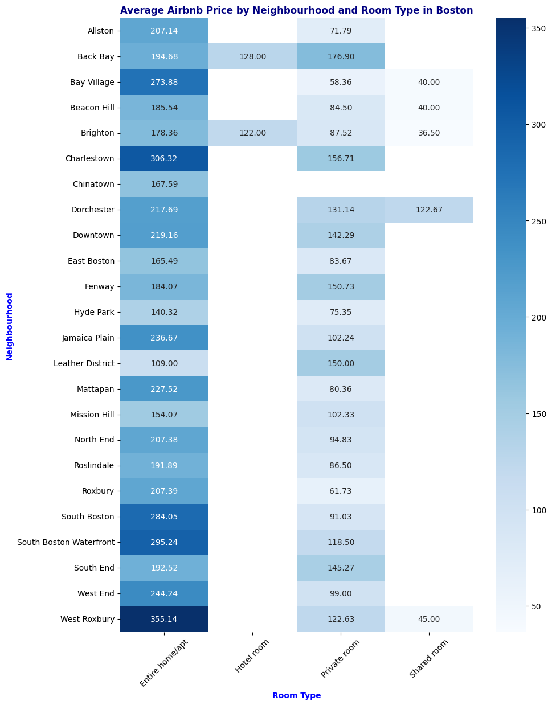

# AirbnbInsights
## Project Overview
The **Boston Airbnb Analysis** is a project that analyzes Airbnb data from Boston. This project provides an insightful exploration of features such as location, price, and popularity within the Boston Airbnb ecosystem. Utilizing Python libraries like Pandas, Matplotlib, and Seaborn, the project excels in transforming raw data into insightful and understandable graphical representations.
## How to Run Analysis
To run this analysis, ensure you have Python installed along with the following libraries:
- pandas
- matplotlib
- seaborn
1. Clone the repository or download the project files.
2. Place the Airbnb Boston dataset in the specified directory.
3. Run the Jupyter notebook to execute the analysis and generate visualizations.
## Key Findings

This bar chart shows the mean price of Airbnb listings across neighborhoods in Boston. From the graph we can conclude:
- The South Boston Waterfront demonstrates itself as the most expensive area, with average prices significantly higher than other neighborhoods.
- A multi layered pricing structure is evident among neighborhoods, with Charlestown, the West End, and West Roxbury featuring as higher-priced areas.
- Hyde Park being the most budget-friendly option

This bar chart ranks the neighborhoods by total Airbnb reviews, which can be used as a representative for popularity. By utilizing this graph we can observe:
- Dorchester leads in popularity with the highest number of reviews, suggesting it is a highly desired location for Airbnb users.
- Some  neighborhoods like Beacon Hill and Back Bay have surprisingly lower review counts, which might indicate higher prices or less rental availability.

This heatmap provides a detailed look at the average price for different room types across neighborhoods:
- West Roxbury, Charlestown, and the South Boston Waterfront have the highest average prices for entire homes or apartments, which might reflect their desirability or larger property sizes.
- Hotel rooms, where available, are priced variably across neighborhoods, with some areas like Allston and the Leather District showing more competitive pricing.
- Shared rooms, while not widely available, present the most economical option across neighborhoods, with significant price drops compared to private rooms and entire homes.

## Data Source
This project analyzes publicly available Airbnb data for Boston. The dataset was accessed from [Boston Airbnb Open Data](https://insideairbnb.com/get-the-data/).
